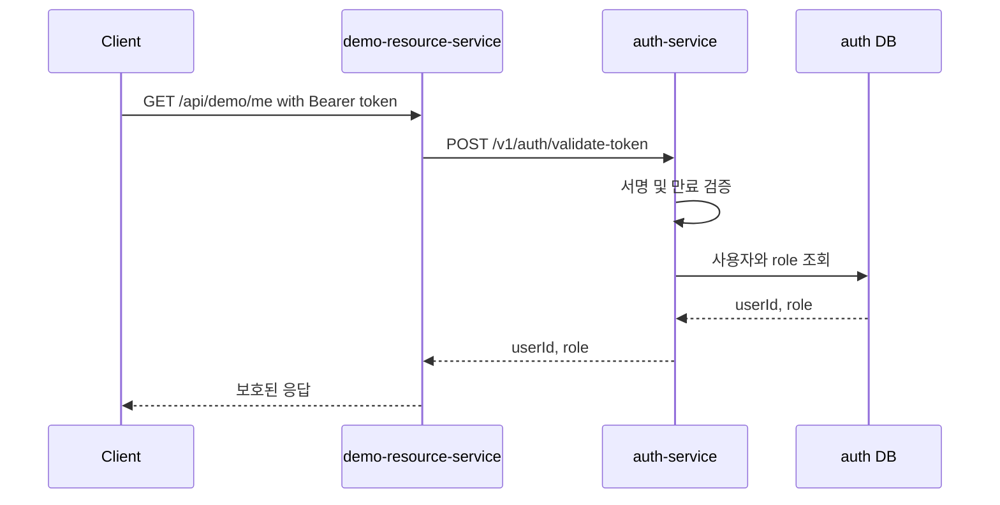
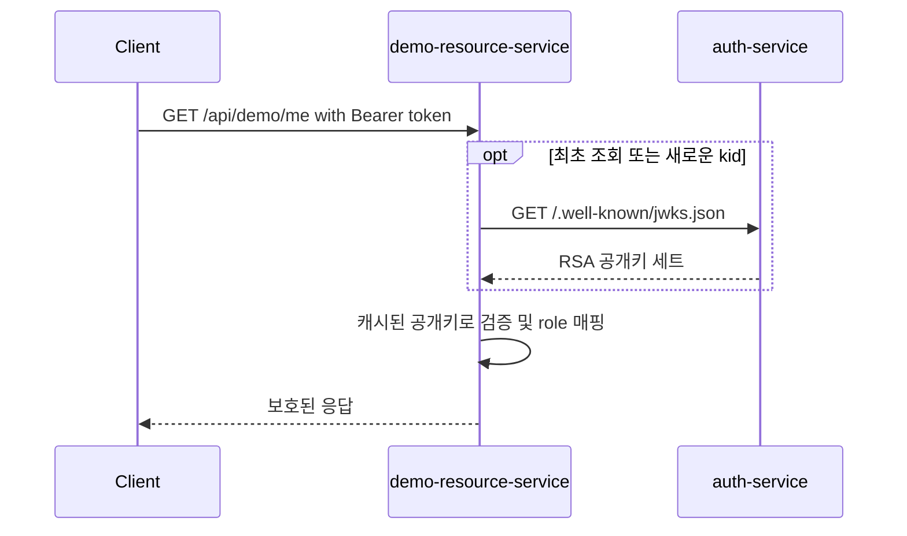

# 아키텍처

## 목표

보호된 API 요청마다 `auth-service`를 호출하는 구조와 JWKS 기반 로컬 검증 구조를 비교

| 비교 항목 | `main` | `refactor/jwks-local-validation` |
| --- | --- | --- |
| 토큰 서명 | HS256 | RS256 |
| 검증 위치 | `auth-service` | resource service |
| 보호 요청당 auth 검증 호출 | 1회 | 0회 (JWKS 캐시 후) |
| 보호 요청당 auth DB 조회 | 1회 | 0회 |
| auth-service 장애 영향 | 보호 요청 실패 | 캐시된 키와 토큰이 유효한 동안 처리 가능 |
| 리소스 서비스 결합 | 검증 API와 응답 DTO | JWKS URI와 JWT 클레임 |

## 컴포넌트

| 컴포넌트 | 역할 |
| --- | --- |
| `auth-service` | 로그인, 토큰 발급/재발급, JWKS 노출 |
| `common-auth-lib` | Spring Security Resource Server 자동 설정 |
| `demo-resource-service` | 인증 구조를 비교하는 최소 보호 API |
| `experiments/k6` | 부하 및 장애 윈도우 트래픽 생성 |

`common-auth-lib`은 `auth.jwk-set-uri`로 `JwtDecoder`를 만들고 stateless 보안 필터 체인을 구성. JWT의 `role` 클레임을 `ROLE_*` 권한으로 매핑해 리소스 서비스가 같은 보안 코드를 반복하지 않게 함

## 인증 흐름

### main

### refactor/jwks-local-validation

## 실험 엔드포인트

| Method | Path | Branch | 목적 |
| --- | --- | --- | --- |
| `POST` | `/v1/auth/dev-token` | both | Kakao OAuth를 제외한 실험용 토큰 발급 |
| `POST` | `/v1/auth/validate-token` | `main` | 중앙 토큰 검증 |
| `GET` | `/.well-known/jwks.json` | refactor | JWT 검증용 RSA 공개키 제공 |
| `GET` | `/api/demo/me` | both | 인증된 `userId`와 권한 확인 |
| `GET` | `/health`, `/actuator/health` | both | 헬스 체크 |

JWKS 응답은 표준 형식이므로 `ApiResponse<T>`로 감싸지 않음. 그 외 `auth-service` 응답은 기존 `ApiResponse<T>` 형식을 따름

## 트레이드오프

- 동기 auth-service 호출과 검증 시점의 DB 조회가 제거됨
- JWKS 최초 조회와 새로운 `kid` 발견 시에는 auth-service가 필요
- 즉시 토큰 폐기가 필요하면 짧은 Access Token TTL, 블랙리스트, introspection 같은 별도 전략이 필요
- 현재 실험 코드는 Access/Refresh 토큰 종류를 강제하지 않음
- issuer/audience 검증은 이번 실험 범위에서 제외
- 로컬 실험은 PEM 파일이 없으면 RSA 키를 메모리에서 생성한다. 운영에서는 안정된 키를 외부 Secret/KMS/Vault 등으로 관리해야 함
