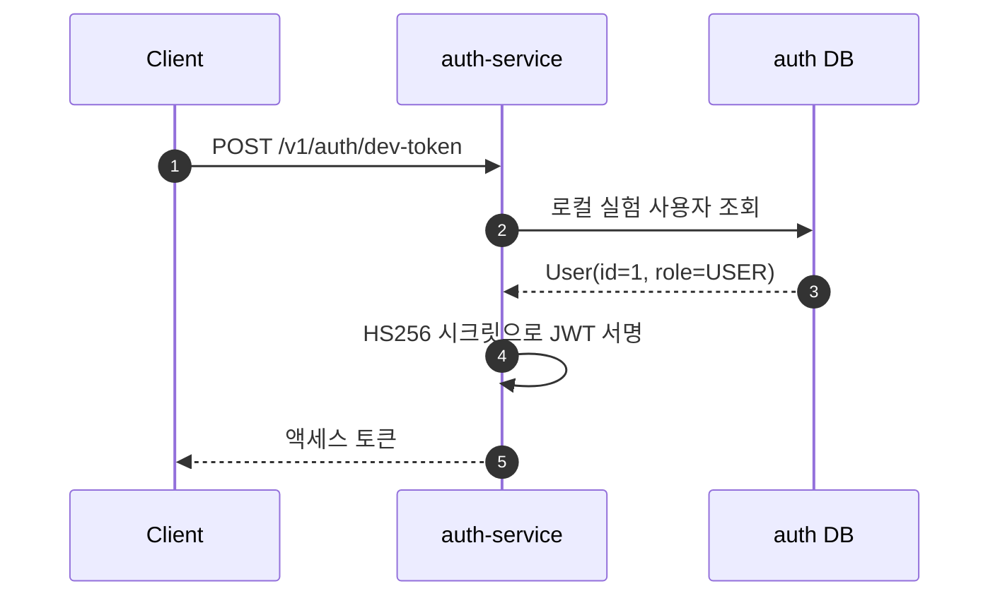
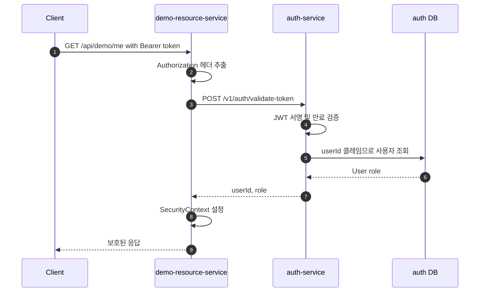
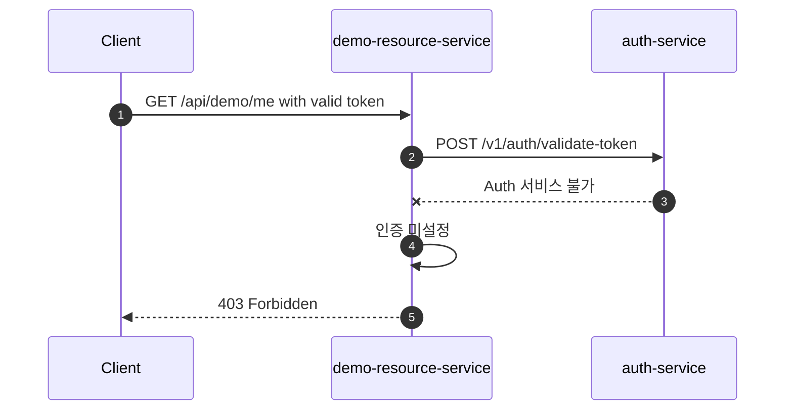

# 베이스라인 시퀀스

JWKS 로컬 검증 이전의 현재 인증 흐름

## 토큰 발급 흐름

- 프로덕션 흐름: 카카오 OAuth 로그인 후 토큰이 발급됨
- 실험 환경(`/v1/auth/dev-token`): 성능 실험에서 OAuth를 제거하기 위해서만 사용

---

## 보호된 API 흐름

---

## 장애 흐름

액세스 토큰이 암호화적으로 유효하더라도, 리소스 서비스는 동기 auth-service 호출에 검증이 의존하기 때문에 요청을 인증할 수 없음

---

## 현재 병목점

- 모든 보호된 요청이 리소스 서비스에서 auth-service로의 네트워크 호출을 생성
- 모든 인증된 리소스 요청에 auth-service 가용성이 필요
- auth-service 레이턴시가 보호된 API 레이턴시에 추가
- 리소스 서비스가 auth 검증 엔드포인트와 응답 DTO에 결합됨
