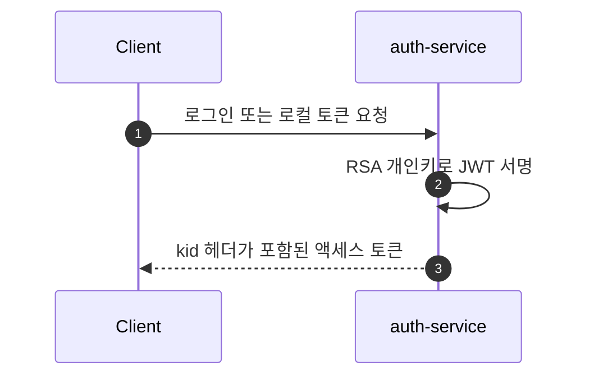
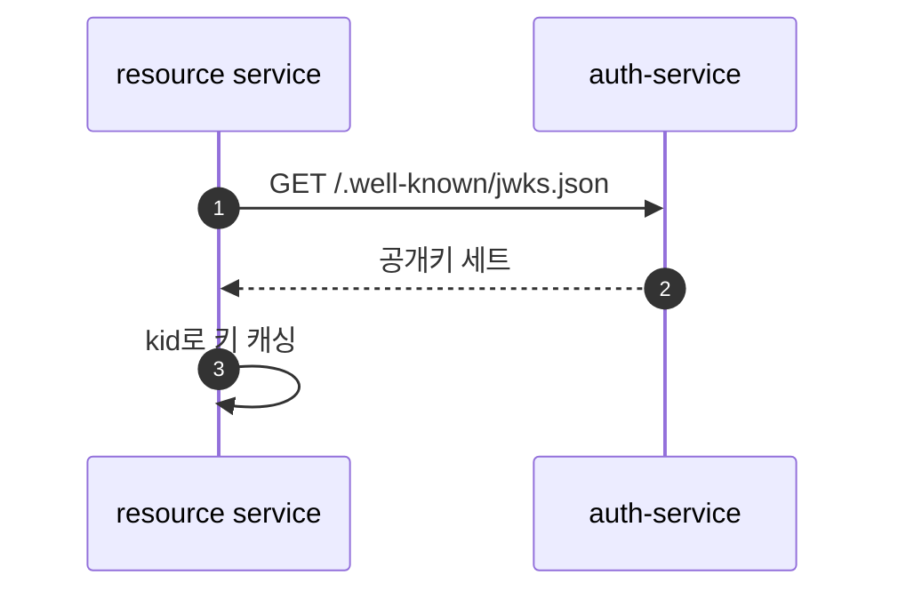
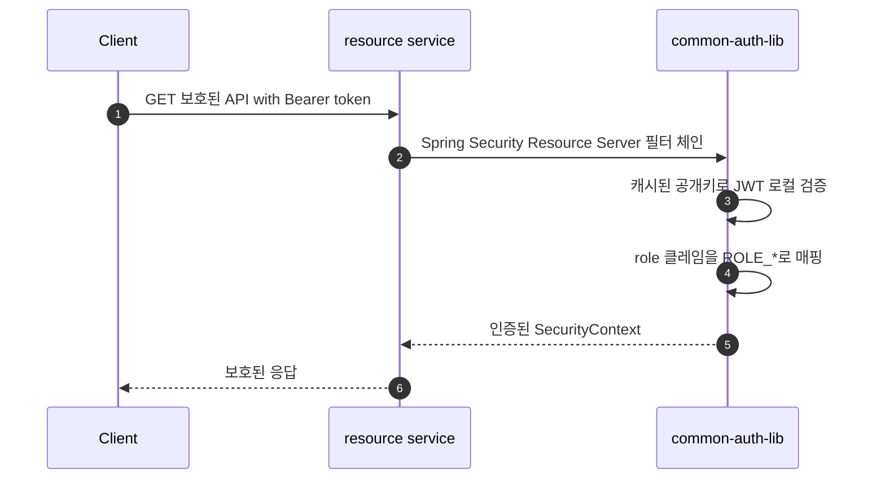

# 리팩토링 목표 시퀀스

## 토큰 발급 흐름

---

## JWKS 발견 흐름

---

## 보호된 API 흐름

---

## 예상되는 차이점

- 보호된 요청이 더 이상 모든 요청마다 auth-service를 호출하지 않음
- auth-service 장애가 이미 발급된 액세스 토큰을 토큰 만료 또는 키 캐시 만료까지 중단시키지 않아야 함
- JWKS 페치는 여전히 외부 의존성이지만 드물게 발생하며 캐시될 수 있음
- 토큰 폐기는 짧은 액세스 토큰 TTL 또는 Redis 블랙리스트 확인과 같은 별도 전략이 필요
- 프로덕션에서 RSA 키는 안정적이어야 하며 외부에서 관리되어야 함. 로컬 폴백 키 생성은 이 실험 환경 전용
- `common-auth-lib`은 리소스 서비스가 동등한 Resource Server 설정을 반복하지 않도록 함
